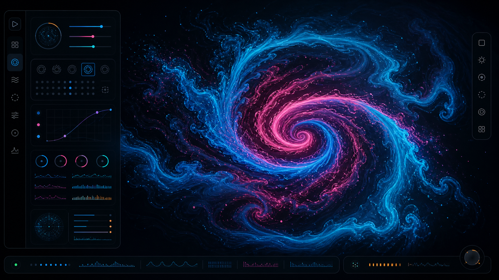
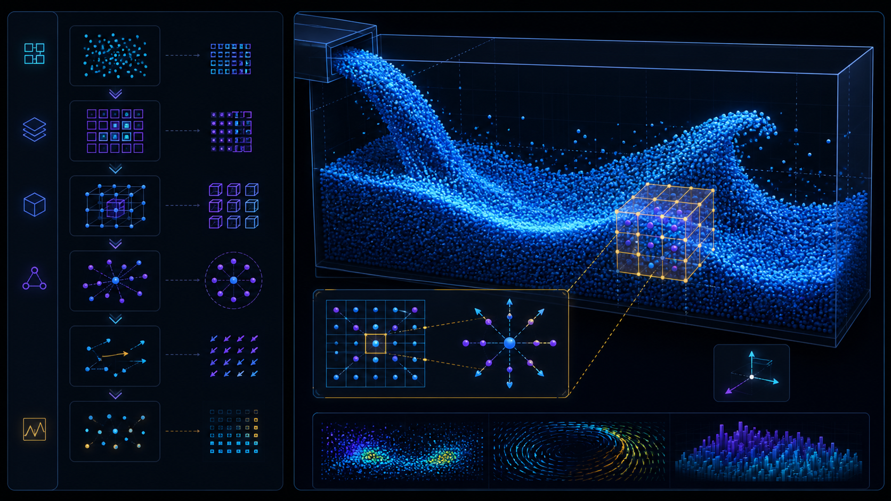

# Native CUDA C++ Stable Fluids Lab

A native CUDA C++ implementation of an interactive 2D incompressible Stable Fluids solver. The CPU owns initialization, device selection, simulation control, and visualization coordination, while CUDA kernels parallelize cell and particle work on the GPU across a fixed 512 × 512 grid. A portable WebGPU preview remains available in the browser.

The native path is organized as an industrial CMake project with persistent device allocations, coalesced row-major field access, shared-memory stencil tiles, stream-ordered asynchronous output, CUDA events, pinned host memory, and checked Runtime API calls. The browser path is a zero-dependency portability preview, not a substitute for the CUDA executable.

## What is included

- Native CUDA C++ solver with CUDA Runtime API lifecycle management and a CPU-owned command-line driver.
- GPU SPH mode with SoA particle arrays, uniform-grid neighbor indexing, density/pressure, force, integration, boundary, and GPU rendering stages.
- Persistent velocity, density, pressure, divergence, vorticity, particle, and presentation buffers reused across all frames.
- Coalesced flat-grid cell access plus 18 × 18 shared-memory halo tiles for neighbor-heavy stencil kernels.
- CUDA streams and events for numerical ordering, GPU timing, and asynchronous pinned-host visualization copies.

- GPU-resident velocity, density, pressure, divergence, and optional vorticity fields.
- 8,192 GPU-resident Lagrangian tracer particles with storage-buffer ping-pong and instanced rendering.
- GPU-generated indirect tracer draw arguments, keeping overlay command data in device-local storage.
- Semi-Lagrangian advection with manual bilinear interpolation for `rg32float` velocity textures.
- Incompressible projection using centered divergence, a selectable 8/20/36 Jacobi pressure workload (20 by default), and pressure-gradient subtraction.
- Continuous pointer strokes using Pointer Events, pointer capture, coalesced events, pressure-safe timing, and a segment-distance splat falloff.
- Optional vorticity confinement for richer curls without changing the default solver path.
- Preset scenes for studio, soft ink, long trails, and turbulent ribbon looks.
- Auto-demo figure-eight flow for hands-off presentation.
- Local PNG snapshots generated from the presentation canvas; nothing is uploaded.
- Optional asynchronous GPU timestamp sampling without a per-frame readback stall.
- In-memory frame pacing and submission telemetry with a local diagnostics JSON export.
- Runtime quality profiles with 8, 20, or 36 Jacobi iterations for explicit performance/quality trade-offs.
- Optional live performance HUD component backed by aggregated CPU/GPU signals, never by per-frame readback.
- Bounded semi-Lagrangian backtracing in both browser WGSL and native CUDA paths for high-velocity resilience.
- Pause/resume, clear/reset, hidden controls, responsive sizing, high-DPI support, visibility-aware timing, and device-loss recovery.
- Accessible labels, keyboard shortcuts, visible focus states, readable status reporting, and reduced-motion startup behavior.

## Project structure

```text
gpu_stable_fluids/
├── CMakeLists.txt             # Native CUDA/C++ build, tests, and architecture configuration
├── CMakePresets.json          # Reproducible CUDA configure/build/test presets
├── fluid-simulation.html       # Stable browser entry shell
├── package.json                # Dependency-free development commands
├── README.md                   # Project overview, usage, design decisions, and maintenance notes
├── src/
│   ├── main.js                 # Application coordinator, WebGPU graph, UI, and input
│   ├── config/
│   │   └── simulation.js       # Shared grid, workload, buffer, and particle constants
│   ├── gpu/
│   │   ├── capabilities.js      # Adapter limits and optional-feature policy
│   │   ├── pipeline-factory.js  # Async pipeline compilation with compatibility fallback
│   │   ├── shaders.js           # WGSL compute/render source catalog
│   │   ├── telemetry.js         # Local frame pacing and GPU sample aggregation
│   │   └── timestamp-profiler.js # Optional asynchronous timestamp-query profiler
│   ├── runtime/
│   │   └── diagnostics.js       # Versioned, local diagnostics report schema
│   └── ui/
│       └── performance-hud.js   # Reusable live telemetry HUD component
├── cuda/
│   ├── include/gpu_fluids/     # Native solver, configuration, diagnostics, and output APIs
│   └── src/                    # CUDA kernels plus CPU command-line visualization driver
├── styles/
│   └── fluid-lab.css           # Design tokens, responsive layout, controls, and accessibility states
├── tests/
│   ├── static-contract.mjs     # WebGPU repository and syntax contract checks
│   ├── runtime-contract.mjs    # Capability, telemetry, and diagnostics unit contracts
│   ├── native/config_contract.cpp # Host/device layout and native constant contracts
│   └── cuda-contract.mjs       # Native CUDA ownership and optimization contract checks
├── tools/
│   └── serve.mjs               # Localhost static server with traversal protection
├── .github/workflows/          # Automated JS quality and opt-in CUDA runner workflows
├── .clang-format               # Native C++/CUDA formatting policy
├── .editorconfig               # Cross-editor whitespace and encoding policy
├── .gitattributes               # Normalized text and binary asset handling
├── .gitignore                  # Local tooling/build output exclusions
├── CONTRIBUTING.md             # GPU change, validation, and branch hygiene practices
└── docs/
    ├── ARCHITECTURE.md         # Runtime components, resource graph, lifecycle, and invariants
    ├── CUDA_NATIVE.md          # Native CUDA ownership, memory, streams, kernels, and build guide
    ├── CUDA_TO_WEBGPU.md       # CUDA concept mapping, tiled kernels, and portability boundaries
    ├── DIAGNOSTICS_SCHEMA.md   # Versioned local diagnostics report contract
    ├── NUMERICAL_METHOD.md     # Stable Fluids equations, coordinate conventions, and GPU passes
    ├── VALIDATION.md            # Static checks, browser smoke tests, and regression checklist
    └── screenshots/             # Repository-bound visual documentation mockups
```

The native runtime is built by CMake and the browser preview deliberately has no `node_modules`, bundler, generated assets, or hidden build output. `package.json` contains only preview, serve, and repository-contract commands and has no dependencies. The documentation is separated into `docs/`, while `cuda/`, `src/`, `styles/`, `tests/`, and `tools/` make ownership boundaries explicit.

## Quick start

### Native CUDA executable

Install the NVIDIA CUDA Toolkit, nvcc, a C++17 compiler, and CMake 3.24 or newer. Configure for the target GPU architecture and build:

    cmake -S . -B build/cuda -DCMAKE_CUDA_ARCHITECTURES=86
    cmake --build build/cuda --config Release

For a reproducible local build, use the checked-in preset (Ninja and the CUDA Toolkit are required):

    cmake --preset cuda-release
    cmake --build --preset cuda-release
    ctest --preset cuda-release

Run the CPU-controlled CUDA demo. It keeps the simulation on the GPU and exports presentation frames through pinned host memory:

    build/cuda/Release/fluid_cuda_demo.exe --frames 120 --export-every 30

Run the particle-based SPH pipeline:

    build/cuda/Release/fluid_cuda_demo.exe --mode sph --frames 120 --export-every 30

See docs/CUDA_NATIVE.md for the resource graph, kernel strategy, synchronization model, tuning guidance, and native validation boundary. This environment has no nvcc, so native compilation must be performed on a CUDA-capable development machine.

### Portable WebGPU preview

WebGPU is normally available only in a secure context. From this directory, use the built-in dependency-free server:

```bash
npm run serve
```

Or use any free local static server. If Python is already installed:

```bash
python -m http.server 8000
```

Then open:

```text
http://localhost:8000/fluid-simulation.html
```

No installation or dependency install is required by this project. Run the repository contract checks with:

```bash
npm run check
```

`npm run check` includes static WebGPU checks, deterministic capability/diagnostics contracts, and native CUDA source contracts. The repository also provides a GitHub Actions quality workflow plus an opt-in self-hosted CUDA workflow for machines tagged `windows,cuda`.

Opening the HTML directly may work in some browsers, but `localhost` is the reliable option for WebGPU’s secure-context and ES-module requirements.

## Visual documentation

The repository includes two visual documentation mockups for the two execution paths. They are stored locally so README rendering does not depend on a hosted image service. The mockups communicate the intended GPU laboratory presentation and CUDA/SPH dataflow; they are not claims of a runtime capture from this environment.





## Portable WebGPU preview hardware target

Use a current desktop Chromium-based browser such as Chrome or Edge with WebGPU enabled. The app checks `window.isSecureContext`, `navigator.gpu`, adapter availability, canvas context creation, shader compilation, pipeline creation, and device loss. If initialization fails, the UI shows a human-readable reason and exposes a `Retry GPU` action.

The application does not provide a WebGL fallback. This is intentional: the numerical path is designed around WebGPU compute and the fallback message explains how to use a supported browser or `localhost`.

## Controls

| Control | Effect |
| --- | --- |
| Ink color | Select any color or use one of the four accessible presets. |
| Brush radius | Sets the soft splat radius in simulation texels. |
| Ink injection | Sets the amount of color and density added per active frame. |
| Velocity force | Scales the drag velocity injected into the field. |
| Velocity dissipation | Exponential velocity decay rate. Lower values preserve motion. |
| Ink dissipation | Exponential density decay rate. Lower values preserve trails. |
| Scene preset | Applies a coherent look and clears the current field. |
| Vortex confinement | Optional curl enhancement. `Off` leaves the base solver unchanged. |
| Pause / Resume | Stops simulation submissions while preserving the current density. |
| Clear | Zeros every simulation texture and resets pointer/timing state. |
| Auto demo | Runs a local procedural figure-eight stroke. Dragging takes control back. |
| Save PNG | Saves the visible canvas locally as a PNG file. |
| Save diagnostics JSON | Saves a local, versioned report containing settings, adapter limits, feature flags, frame pacing, submissions, and asynchronous GPU samples. |
| Quality profile | Selects Performance (8), Balanced (20), or Cinematic (36) Jacobi pressure iterations at runtime. |
| Performance HUD | Shows live CPU encode, asynchronous GPU sample, submission, pressure, tracer, and adapter data over the canvas. |

Keyboard shortcuts:

- `Space` — pause or resume.
- `C` or `R` — clear the simulation.
- `H` — hide or show the control panel.

Shortcuts are ignored while a range or color input is being edited.

## GPU architecture

The simulation grid never changes size. It is always 512 × 512 texels and dispatches 32 × 32 workgroups of 16 × 16 threads. Only the presentation canvas is resized to the CSS size and a capped device-pixel ratio of 2.

The GPU resources are created once during initialization and reused:

- Two `rg32float` velocity textures.
- Two `rgba16float` density textures containing RGB ink and alpha coverage.
- Two `r32float` pressure textures.
- One `r32float` divergence texture.
- One `r32float` vorticity texture used by the optional curl enhancement.
- Two 16-byte-stride particle storage buffers used for GPU-only tracer advection.
- One 16-byte indirect-arguments buffer generated by a dedicated compute pass and consumed by the tracer draw.
- One 112-byte uniform buffer, cached shader modules, pipeline layouts, pipelines, samplers, texture views, and bind groups.
- Optional timestamp query set plus resolve/readback buffers when the adapter exposes `timestamp-query`.

Every read/write stage uses distinct ping-pong sides. The JavaScript resource state keeps the currently readable velocity, density, and pressure index explicit. Bind groups are created for every legal index combination during initialization; they are never recreated in the animation loop.

The normal active-frame order is:

```text
uniform upload
  → optional GPU timestamp begin
  → splat injection
  → velocity/density swap
  → semi-Lagrangian advection
  → velocity/density swap
  → optional vorticity + confinement
  → divergence
  → selected Jacobi pressure passes (8 / 20 / 36)
  → pressure-gradient subtraction
  → velocity swap
  → GPU-generated tracer draw arguments
  → 8,192-particle GPU tracer advection
  → particle-buffer swap
  → full-screen density render
  → instanced tracer overlay
  → optional GPU timestamp end + asynchronous resolve
  → one queue submission
```

Each Jacobi iteration is a separate compute pass inside the same command encoder so WebGPU usage scopes do not alias a sampled pressure texture with its storage destination. There is no GPU readback or `queue.onSubmittedWorkDone()` in the normal loop.

### CUDA-inspired GPU techniques (browser-safe)

The solver now uses a CUDA-like tiled stencil design while remaining a zero-install browser application. Divergence, pressure, and vorticity kernels cooperatively stage an 18 × 18 tile in `var<workgroup>` memory: 16 × 16 invocations cover the interior and the surrounding one-texel halo supplies neighbor values. A `workgroupBarrier()` then makes the tile visible before the stencil is evaluated. This reduces repeated global texture reads for the neighbor-heavy passes and mirrors the structure of a CUDA `__shared__` tile plus `__syncthreads()`.

The page also reports adapter identity and compute limits, wraps initialization in a WebGPU validation error scope, and handles uncaptured validation errors and device loss. When available, `timestamp-query` measures the complete GPU frame asynchronously every 30 frames; the timer never maps a buffer or waits for GPU completion inside the animation loop. These are WebGPU equivalents of the diagnostics and capability checks expected in a native GPU application.

The diagnostics panel keeps a small in-memory view of CPU encode time, frame pacing, submitted command buffers, and asynchronous GPU timestamp samples. `Save diagnostics JSON` serializes that state together with the active solver settings, adapter limits, device features, workgroup shape, and simulation constants. The report is created with a browser object URL and is never uploaded.

The tracer toggle controls a fully GPU-resident Lagrangian visualization. A 64-thread compute kernel samples the projected velocity field, integrates each particle, respawns escaped or expired particles deterministically, and swaps storage buffers. An instanced render pipeline draws all particles without a CPU position readback; disabling the toggle skips both the compute and overlay draw.

The tracer overlay also uses a one-invocation GPU pass to write the four-word indirect draw command. The render pass consumes that command directly, so neither particle positions nor the draw count cross the GPU/CPU boundary.

The native executable is the CUDA Runtime API implementation described in this README. The WebGPU preview is the portable sibling: it mirrors the numerical stages with WGSL but cannot execute `.cu` kernels, call cuBLAS/cuFFT, inspect CUDA occupancy counters, or use NVIDIA-only warp intrinsics. The exact native ownership and tuning model is in [docs/CUDA_NATIVE.md](docs/CUDA_NATIVE.md), while [docs/CUDA_TO_WEBGPU.md](docs/CUDA_TO_WEBGPU.md) documents the portability mapping.

See [docs/ARCHITECTURE.md](docs/ARCHITECTURE.md) for the resource graph and recovery lifecycle. `src/main.js` remains the composition root so the zero-build browser runtime has one owner for pass ordering, while configuration and optional profiling are independently reusable modules.

## Numerical conventions

Simulation coordinates use texel units with texel centers at `(x + 0.5, y + 0.5)`. Pointer coordinates map from the CSS canvas rectangle directly into the 512 × 512 domain, with Y increasing downward in every pass. Velocity is stored in texels per second. Frame delta is clamped to 1/30 second and reset after visibility changes.

Advection uses manual bilinear sampling because the velocity field is `rg32float` and must not depend on hardware filtering. Dissipation uses the frame-rate-independent form:

```text
decay = exp(-dissipationRate × deltaTime)
```

The browser WGSL and native CUDA implementations cap each semi-Lagrangian backtrace at 48 texels. This guards the interpolation footprint against extreme velocities and long-frame recovery while preserving the normal GPU-resident update path.

The pressure solve uses Neumann-like boundary samples, while velocity boundary samples mirror the normal component and the final projection explicitly zeros normal velocity on the outer grid. Full equations and coordinate details are in [docs/NUMERICAL_METHOD.md](docs/NUMERICAL_METHOD.md).

## Reliability and privacy

- Device loss stops the animation loop before resource references are released.
- Retry rebuilds the adapter, device, canvas configuration, textures, layouts, pipelines, bind groups, and zeroed state.
- Uncaptured validation errors are surfaced in the status panel and console.
- Large frame gaps, pointer re-entry, and long pointer-event gaps cannot create unbounded velocity impulses.
- PNG export uses a browser object URL and is revoked immediately after the local download is triggered.
- Diagnostics export is a local JSON object URL containing only current runtime settings and aggregated performance counters; it is not network telemetry.
- No network request, telemetry, tracking, advertisement, external font, image, shader, or package is used at runtime.

## Validation performed

The implementation has been checked with JavaScript parsing, diff whitespace checks, WebGPU static requirements, a native CUDA source contract, and a Chrome WebGPU smoke test. nvcc is not installed in the current environment, so the native translation unit still needs a CUDA-capable build machine for compiler and hardware validation. The browser test covered initialization, shader compilation, pipeline creation, normal drag painting, color preset selection, turbulent/vorticity mode, auto-demo, pause/resume, clear, responsive layout, indirect tracer rendering, local diagnostics export, and console validation errors.

Use [docs/VALIDATION.md](docs/VALIDATION.md) for the repeatable checklist and maintenance guidance.

## License and cost

The repository contains no paid service integration or third-party runtime dependency. It uses native browser APIs and the user’s existing hardware only. Add a project license separately if this code is redistributed under a specific legal license.
